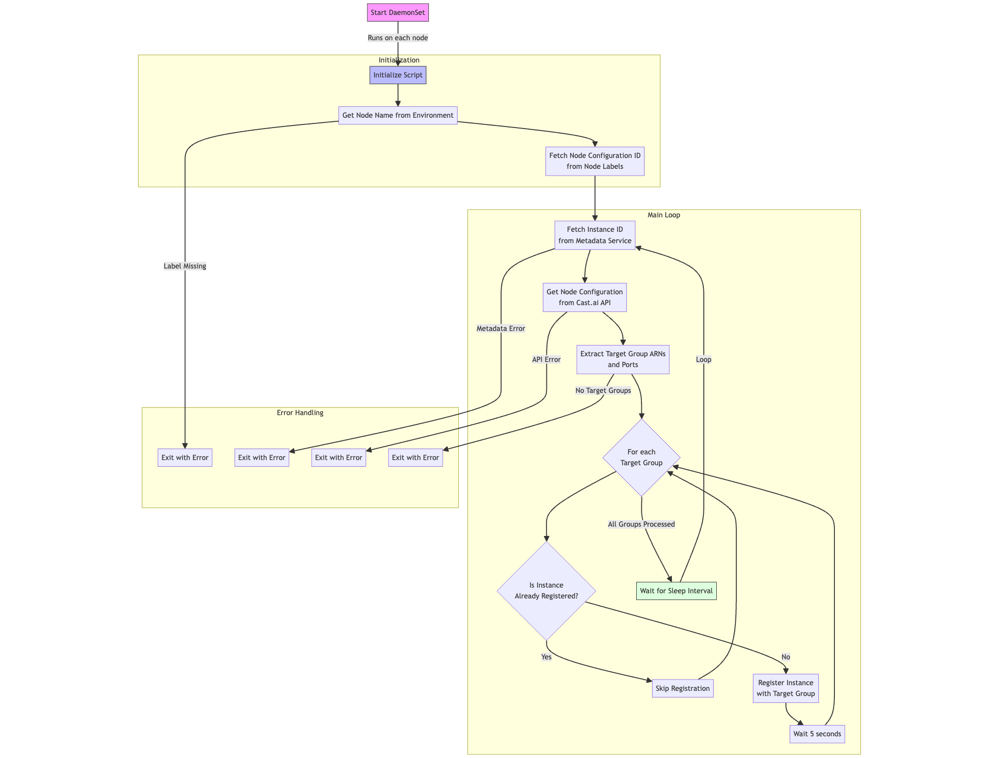

# castai-tg-auto-registration-ds
# EKS Target Group Auto-Registration System

This solution provides automated target group registration for EKS nodes using a DaemonSet that monitors and registers EC2 instances with their designated Application Load Balancer (ALB) target groups based on Cast.ai node configurations.

## Overview

The system runs as a DaemonSet on your EKS cluster, automatically registering each node with the appropriate target groups defined in your Cast.ai node configurations. It continuously monitors the registration status and ensures nodes remain registered even after cluster changes.



## Prerequisites

- An EKS cluster
- AWS CLI configured with appropriate permissions
- kubectl access to your cluster
- Cast.ai integration configured
- Necessary IAM permissions for target group registration

## Required AWS IAM Permissions in node role

The following IAM permissions are required for the nodes:

```json
{
    "Version": "2012-10-17",
    "Statement": [
        {
            "Effect": "Allow",
            "Action": [
                "elasticloadbalancing:DescribeTargetGroups",
                "elasticloadbalancing:DescribeTargetHealth",
                "elasticloadbalancing:RegisterTargets",
                "elasticloadbalancing:DeregisterTargets",
                "elasticloadbalancing:DescribeLoadBalancers",
                "elasticloadbalancing:DescribeListeners",
                "ec2:DescribeInstances"
            ],
            "Resource": "*"
        }
    ]
}
```

## Configuration

### Environment Variables

| Variable | Description | Default |
|----------|-------------|---------|
| CLUSTER_NAME | Name of your EKS cluster | Required |
| AWS_REGION | AWS region where the cluster is deployed |Required  |
| CLUSTER_API_KEY | Your Cast.ai API key | Required |
| CLUSTER_ID | Your Cast.ai cluster ID | Required |
| SLEEP_INTERVAL | Interval between registration checks (seconds) | 300 |
| DEBUG | Enable debug logging | false |

## Installation

1. Clone this repository:
```bash
git clone https://github.com/your-org/eks-target-registration
cd eks-target-registration
```

2. Update the configuration:
```bash
# Edit the ConfigMap in manifests/config.yaml to set your values
vim manifests/config.yaml
```

3. Apply the manifests:
```bash
kubectl apply -f manifests/
```

## Components

### 1. ConfigMap
Contains the registration script that runs on each node.

### 2. DaemonSet
Ensures the registration script runs on all nodes in the cluster.

### 3. RBAC Configuration
- ServiceAccount: `target-registrar-sa`
- ClusterRole: Provides permissions to read node information
- ClusterRoleBinding: Binds the ServiceAccount to the ClusterRole

## How It Works

1. The DaemonSet creates a pod on each node in the cluster
2. The script retrieves the node's configuration ID from Cast.ai labels
3. It fetches the target group configurations from the Cast.ai API
4. For each target group:
   - Checks if the node is already registered
   - Registers the node if needed
   - Maintains registration status
5. Process repeats based on the configured interval

## Monitoring

You can monitor the registration process using kubectl:

```bash
# View DaemonSet status
kubectl get ds target-registrar

# Check pod logs
kubectl logs -l app=target-registrar

# View pod status
kubectl get pods -l app=target-registrar
```

## Troubleshooting

### Common Issues

1. Pods not starting:
```bash
kubectl describe pod -l app=target-registrar
```

2. Registration failures:
```bash
kubectl logs -l app=target-registrar
```

3. Permission issues:
- Verify IAM roles
- Check RBAC configurations
- Ensure Cast.ai API key is valid


**Note**: Replace placeholder values (API keys, cluster IDs, etc.) with your actual configuration before deploying.
